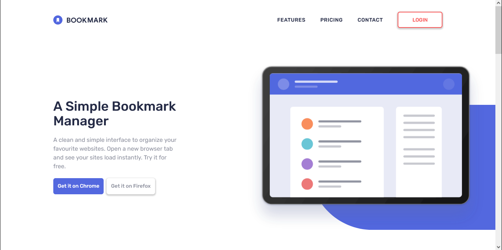

# Frontend Mentor - Bookmark landing page solution

This is a solution to the [Bookmark landing page challenge on Frontend Mentor](https://www.frontendmentor.io/challenges/bookmark-landing-page-5d0b588a9edda32581d29158). Frontend Mentor challenges help you improve your coding skills by building realistic projects. 

## Table of contents

- [Overview](#overview)
  - [The challenge](#the-challenge)
  - [Screenshot](#screenshot)
  - [Links](#links)
- [My process](#my-process)
  - [Built with](#built-with)
  - [What I learned](#what-i-learned)
  - [Continued development](#continued-development)
  - [Useful resources](#useful-resources)
- [Author](#author)

**Note: Delete this note and update the table of contents based on what sections you keep.**

## Overview

### The challenge

Users should be able to:

- View the optimal layout for the site depending on their device's screen size
- See hover states for all interactive elements on the page
- Receive an error message when the newsletter form is submitted if:
  - The input field is empty
  - The email address is not formatted correctly

### Screenshot

### Links

- Solution URL: [Add solution URL here](https://your-solution-url.com)
- Live Site URL: [Add live site URL here](https://your-live-site-url.com)

## My process

### Built with

- useContext API
- [React](https://reactjs.org/) - JS library
- [Tailwindcss](https://tailwindcss.com) - CSS library

### What I learned

I learned how to make use of some of the react hooks, which are most commonly used though, which is useState, useEffect, and useContext, and I now have the complete understanding of how to use these three commonly used react hooks. And it was really fun building the project.

### Continued development

- React Hooks
- Redux Toolkit
- Tailwindcss Animations
- ES6 and above features
- Axios

### Useful resources

- [ChatGpt](https://www.chat.openai.com) - ChatGpt is a great tool to make use of, it's been useful to me because I use it as a refresher for some code snippets that I have forgotten as well for some logic that I do not know how to start the code.

## Author

- Frontend Mentor - [@T-tech26](https://www.frontendmentor.io/profile/T-tech26)
- LinkedIn - [Tariladei Doutua](https://www.your-site.com)
- Twitter - [@TariDoutua](https://www.twitter.com/yourusername)

